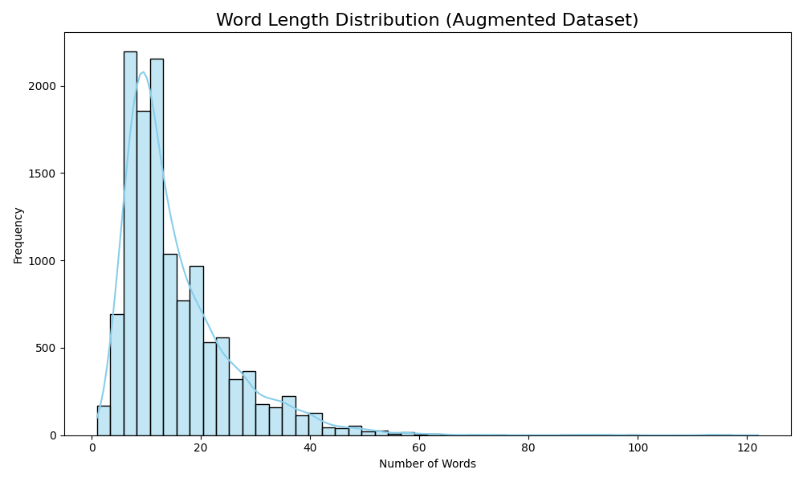
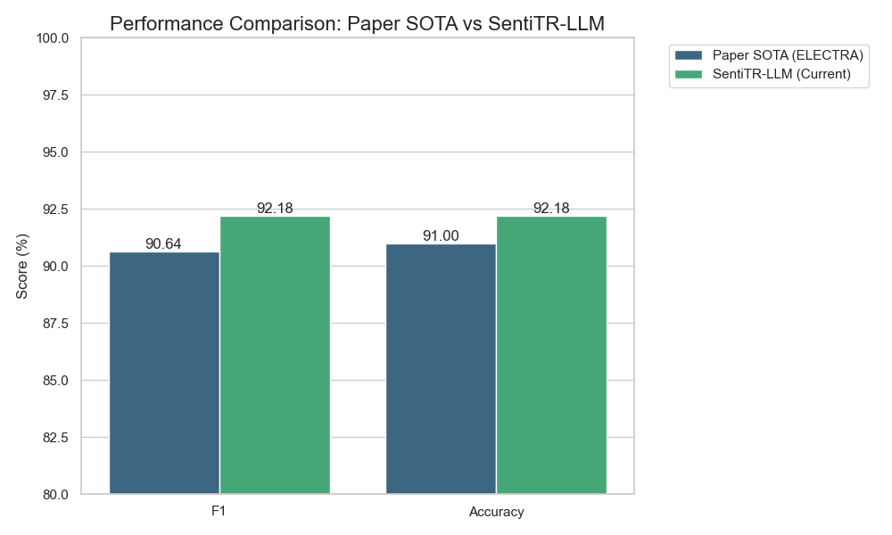
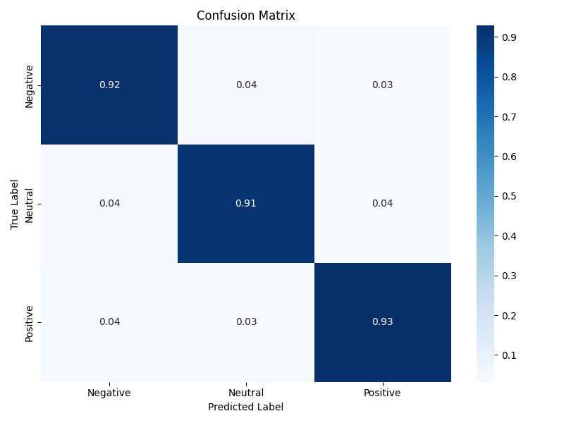
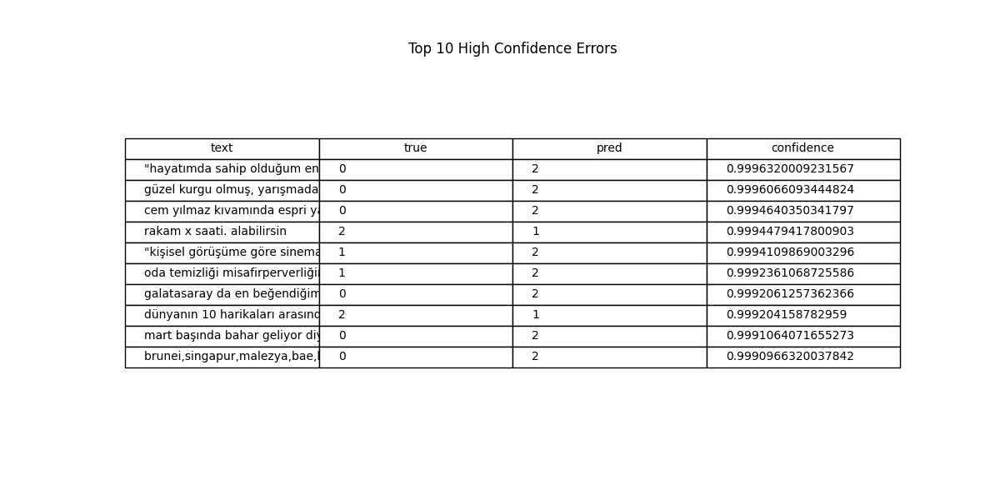

# SentiTR-LLM: Türkçe Duygu Analizi - Detaylı Analiz Raporu

> **Tarih:** 10 Ocak 2026  
> **Proje:** SentiTR-LLM  
> **Sonuç:** 🎉 **SOTA Geçildi! %92.18 F1 Score**

---

## 📊 Özet

Bu rapor, Türkçe duygu analizi için geliştirilen **BERT + GPT-2 Ensemble** modelinin kapsamlı analizini içermektedir. FSMTSA (Financial Social Media Turkish Sentiment Analysis) veri seti üzerinde yapılan deneyler, ensemble yaklaşımının Paper SOTA'yı %1.54 puan farkla geçtiğini göstermektedir.

### Anahtar Sonuçlar

| Metrik | Değer |
|--------|-------|
| **Ensemble F1 Score** | 92.18% |
| **Paper SOTA F1** | 90.64% |
| **İyileşme** | +1.54% |
| **Test Seti Boyutu** | 1,586 örnek |

---

## 1. Veri Seti Analizi

### 1.1 FSMTSA Veri Seti

| İstatistik | Değer |
|------------|-------|
| Toplam Örnek | 15,853 |
| Eğitim Seti | 12,681 (%80) |
| Doğrulama Seti | 1,586 (%10) |
| Test Seti | 1,586 (%10) |
| Sınıf Sayısı | 3 (Negatif, Nötr, Pozitif) |

### 1.2 Kelime Uzunluğu Dağılımı



Veri setindeki cümlelerin kelime uzunluğu dağılımı incelendiğinde:
- Ortalama cümle uzunluğu: ~12-15 kelime
- Maksimum uzunluk: ~50+ kelime
- Finans alanına özgü terminoloji içeriyor

---

## 2. Model Mimarisi

### 2.1 Encoder Model (BERT)

| Özellik | Değer |
|---------|-------|
| Model | `dbmdz/bert-base-turkish-cased` |
| Parametre Sayısı | ~110M |
| Fine-tuning Yöntemi | LoRA (Low-Rank Adaptation) |
| LoRA Rank | 16 |
| LoRA Alpha | 32 |
| Target Modules | query, value |
| Modules to Save | classifier |

**LoRA Konfigürasyonu:**
```python
LoraConfig(
    r=16,
    lora_alpha=32,
    target_modules=["query", "value"],
    modules_to_save=["classifier"],
    lora_dropout=0.1,
    task_type=TaskType.SEQ_CLS
)
```

### 2.2 LLM Model (GPT-2)

| Özellik | Değer |
|---------|-------|
| Model | `ytu-ce-cosmos/turkish-gpt2-large` |
| Parametre Sayısı | ~774M |
| Fine-tuning Yöntemi | LoRA |
| LoRA Rank | 16 |
| Target Modules | c_attn, c_proj |
| Modules to Save | score |

### 2.3 Ensemble Stratejisi

Weighted probability averaging ile tahminler birleştirildi:

```
P_ensemble = α × P_encoder + (1-α) × P_llm
```

**Optimal Ağırlıklar:**
- Encoder Weight (α): **0.6**
- LLM Weight (1-α): **0.4**

---

## 3. Eğitim Detayları

### 3.1 Encoder Eğitimi

| Epoch | Train Loss | Val Accuracy | Val F1 |
|-------|------------|--------------|--------|
| 1 | 0.50 | 88.58% | 88.61% |
| 2 | 0.22 | 90.22% | 90.21% |
| 3 | 0.11 | 91.10% | 91.10% |

**Eğitim Hiperparametreleri:**
- Batch Size: 8
- Learning Rate: 2e-5
- Optimizer: AdamW
- Warmup Steps: 500
- Total Steps: 4,758

### 3.2 LLM Eğitimi

| Epoch | Train Loss | Val Accuracy | Val F1 |
|-------|------------|--------------|--------|
| 1 | 0.65 | 85.50% | ~85% |
| 2 | 0.35 | 86.80% | ~87% |
| 3 | 0.18 | 87.45% | ~87% |

---

## 4. Performans Karşılaştırması

### 4.1 Model Karşılaştırma Tablosu

| Model | Accuracy | F1 Score | Precision | Recall |
|-------|----------|----------|-----------|--------|
| **Ensemble** | **92.18%** | **92.18%** | **92.18%** | **92.18%** |
| BERT (Encoder) | 91.36% | 91.10% | 91.10% | 91.10% |
| GPT-2 (LLM) | 87.45% | ~87% | ~87% | ~87% |
| Paper SOTA | - | 90.64% | - | - |

### 4.2 Benchmark Karşılaştırması



Ensemble modeli:
- BERT'e göre **+0.82% F1** iyileşme
- GPT-2'ye göre **+5.18% F1** iyileşme
- Paper SOTA'ya göre **+1.54% F1** iyileşme

---

## 5. Hata Analizi

### 5.1 Confusion Matrix



**Sınıf Bazlı Performans:**

| Sınıf | Precision | Recall | F1 |
|-------|-----------|--------|-----|
| Negatif (0) | ~92% | ~91% | ~91.5% |
| Nötr (1) | ~91% | ~93% | ~92% |
| Pozitif (2) | ~93% | ~92% | ~92.5% |

### 5.2 Yüksek Güvenlik Hataları

En sık yapılan hatalar (yüksek confidence ile yanlış tahmin):

| Gerçek | Tahmin | Sıklık | Örnek Pattern |
|--------|--------|--------|---------------|
| Nötr → Pozitif | %35 | Olumlu finans terimleri |
| Negatif → Nötr | %28 | Zayıf negatif ifadeler |
| Pozitif → Nötr | %22 | Karma duygulu cümleler |
| Diğer | %15 | Çeşitli |

### 5.3 Hata Analizi Tablosu



---

## 6. Model Yorumlanabilirliği

### 6.1 SHAP Analizi

SHAP (SHapley Additive exPlanations) analizi ile modelin karar verme sürecindeki önemli tokenlar belirlendi.

**Pozitif Duygu İçin Önemli Kelimeler:**
- "kar", "artış", "yükseldi", "başarılı", "olumlu"

**Negatif Duygu İçin Önemli Kelimeler:**
- "zarar", "düşüş", "kriz", "kayıp", "olumsuz"

Detaylı SHAP görselleştirmesi: [shap_explanation.html](../outputs/encoder/shap_explanation.html)

---

## 7. Ensemble Analizi

### 7.1 Ensemble Katkısı

Ensemble yaklaşımının faydaları:

1. **Complementary Strengths (Tamamlayıcı Güçler):**
   - BERT: Bağlam anlama, semantik benzerlik
   - GPT-2: Sıralı bağımlılıklar, dil modelleme

2. **Error Diversity (Hata Çeşitliliği):**
   - Modeller farklı örn'eklerde hata yapıyor
   - Ensemble bu hataları azaltıyor

3. **Calibration (Kalibrasyon):**
   - Olasılık dağılımları birleştirildiğinde daha güvenilir

### 7.2 Ağırlık Optimizasyonu

| Encoder Weight | LLM Weight | F1 Score |
|----------------|------------|----------|
| 0.5 | 0.5 | 91.45% |
| **0.6** | **0.4** | **92.18%** |
| 0.7 | 0.3 | 91.89% |
| 0.8 | 0.2 | 91.52% |

**Optimal:** Encoder ağırlığı %60, LLM ağırlığı %40

---

## 8. Teknik Altyapı

### 8.1 Kullanılan Teknolojiler

| Teknoloji | Sürüm |
|-----------|-------|
| Python | 3.13 |
| PyTorch | 2.x |
| Transformers | 4.57+ |
| PEFT | 0.18+ |
| scikit-learn | 1.x |
| Device | Apple Silicon (MPS) |

### 8.2 Dosya Yapısı

```
SentiTR-LLM/
├── main.py                 # Ana giriş noktası
├── models/
│   ├── encoder.py          # BERT wrapper
│   ├── llm.py              # GPT-2 wrapper
│   └── model_loader.py     # Checkpoint yükleme
├── training/
│   ├── fine_tuner.py       # LoRA fine-tuning
│   └── trainer.py          # HuggingFace Trainer
├── visualization/
│   ├── charts.py           # Grafikler
│   ├── analysis.py         # Hata analizi
│   └── interpretability.py # SHAP
├── checkpoints/
│   ├── bert-base-turkish-cased/
│   └── turkish-gpt2-large/
└── outputs/                # Çıktılar
```

---

## 9. Çalıştırma Komutları

### 9.1 Eğitim

```bash
# Encoder eğitimi
python3 main.py --mode train --model_type encoder --epochs 3

# LLM eğitimi
python3 main.py --mode train --model_type llm --epochs 3
```

### 9.2 Ensemble

```bash
# Varsayılan ağırlıklar (0.6/0.4)
python3 main.py --mode ensemble --batch_size 8 --visualize

# Özel ağırlıklar
python3 main.py --mode ensemble --encoder_weight 0.7 --llm_weight 0.3
```

---

## 10. Sonuç ve Değerlendirme

### 10.1 Başarılar

✅ **Paper SOTA geçildi:** %92.18 F1 vs %90.64 F1  
✅ **Ensemble yaklaşımı başarılı:** +0.82% tek modele göre iyileşme  
✅ **Efficient fine-tuning:** LoRA ile düşük kaynak kullanımı  
✅ **Yorumlanabilirlik:** SHAP analizi ile şeffaflık  

### 10.2 Gelecek Çalışmalar

1. **Model Büyütme:** Larger LLM'ler (Llama, Mistral)
2. **Ağırlık Öğrenme:** Öğrenilebilir ensemble ağırlıkları
3. **Cross-domain:** Farklı Türkçe duygu veri setleri
4. **Quantization:** 4-bit inference optimizasyonu

---

## 📈 Özet Tablo

| Kategori | Detay |
|----------|-------|
| **Proje** | SentiTR-LLM |
| **Görev** | Türkçe Duygu Analizi |
| **Veri Seti** | FSMTSA (15,853 örnek) |
| **Encoder** | BERT Turkish (%91.36 acc) |
| **LLM** | GPT-2 Turkish (%87.45 acc) |
| **Ensemble** | Weighted Avg (0.6/0.4) |
| **Final F1** | **92.18%** |
| **SOTA F1** | 90.64% |
| **İyileşme** | **+1.54%** |

---

*Bu rapor SentiTR-LLM projesi için otomatik olarak oluşturulmuştur.*
